### 软件工程高级实践
用springcloud重构项目

2023.3.15 除积分和钱包模块外，其他模块前五阶段（到gateway）已经完成重构

2023.4.3 项目重构完成

[配置文件仓库](https://gitee.com/liu-jingzong/scc-test)

 

 

 

**学   院**  **智能与计算学部**    

**专   业**   **软件工程**      

**年   级**    **2020级**       

**姓   名**   **刘京宗  缪妍**    

​       **田欣悦  王明源**   

# 

 

[TOC]

# 第1章 项目需求

## 1. 简介

​	本项目是“饿了么”外卖平台，能够提供展示购买食品、订单管理、积分兑换、虚拟钱包等外卖平台常用功能，能够完成一套完整的网上订餐流程。

## 1.1  背景

​	本项目参照“饿了么官网网页版”制作。本项目专注于完成点餐业务线功能，“饿了么官网”中的其它功能暂不涉及。以下内容大致概括了本系统的项目需求： 

(1)用户信息管理:在用户进入系统前要求客户进行登录，未注册的用户需要 注册后方可登录。登录时需要对用户Id和密码进行校验，正确后即可登录。 

(2)商家信息管理：向用户提供商家名称、 地址、 图片以及食物等相关信息。 

(3)购物车及订单管理：允许用户向购物车中添加或删除食物，并生成相关 订单。 

(4)用户地址管理：一个用户可以拥有多个收货地址并对地址进行修改，保 存。 

(5)虚拟钱包：钱包支持充值、提现、支付、查询余额、查询交易流水这五个核心的功能。

(6)积分模块：能够通过多种途径获取积分、消费积分、显示积分的获取流水记录和积分的使用流水记录。

## 1.2  定义、缩略语

文档中术语如下：

| 术语 | 解释 |
| ---- | ---- |
| 无   | 无   |

## 1.3  约束

- 使用Spring Cloud框架进行后端开发。

- 使用MySQL作为后端数据库。

- 使用Vue框架作为前端框架。

## 1.4  参考资料

​	本文档参考的上游文档、资料等

| 资料名称                           | 版本/日期           | 说明 |
| ---------------------------------- | ------------------- | ---- |
| UML大战需求分析                    | 2012年2月第1版      |      |
| 阿里巴巴-Java开发手册-1.7.0-嵩山版 | 2020年8月 1.7.0版本 |      |
| 深入理解计算机系统                 | 2018年4月第1版      |      |
| HTML5 权威指南                     | 2014年1月第1版      |      |
| CSS权威指南 第4版上下册            | 2019年4月           |      |
| 深入解析CSS                        | 2020年4月第1版      |      |
| JavaScript高级程序设计 第4版       | 2020年9月           |      |
| JavaScript 指南 原书第7版          | 2021年4月           |      |
| HTTP权威指南                       | 2012年9月第1版      |      |
| 计算机网络：自顶向下方法           | 2022年8月第8版      |      |
| 深入理解Spring Cloud与微服务构建   | 2019年9月1日第2版   |      |

## 2. 目标、涉众分析和范围

## 2.1  目标

- 实现商品展示和购买功能。

- 实现订单管理功能。

- 实现用户注册、登陆功能。

- 实现虚拟钱包、积分系统功能。

## 2.2  涉众分析

涉众分析表：

| 序号 | 涉众   | 待解决的问题/对系统的期望                                    |
| ---- | ------ | ------------------------------------------------------------ |
| 1    | 消费者 | 能方便的进行商品的浏览。能方便的将喜欢的商品加入购物车暂时储存。能方便的进行账户的注册、登录。能方便的管理账户的基本信息、订单、收货地址、购物车。购物能够获取积分，并获取相应优惠。能够从平台的展示界面获取最新消息、商品推送等。能够使用应用内的虚拟钱包进行存储和支付 |

## 2.3  范围

​	本系统暂未与支付宝或微信支付对接来实现在线支付功能。

## 3. 业务概念分析

## 3.1  概述

本系统要管理的事情主要有：外卖下单业务，积分系统，虚拟钱包，订单管理。

## 3.2  业务概念一览

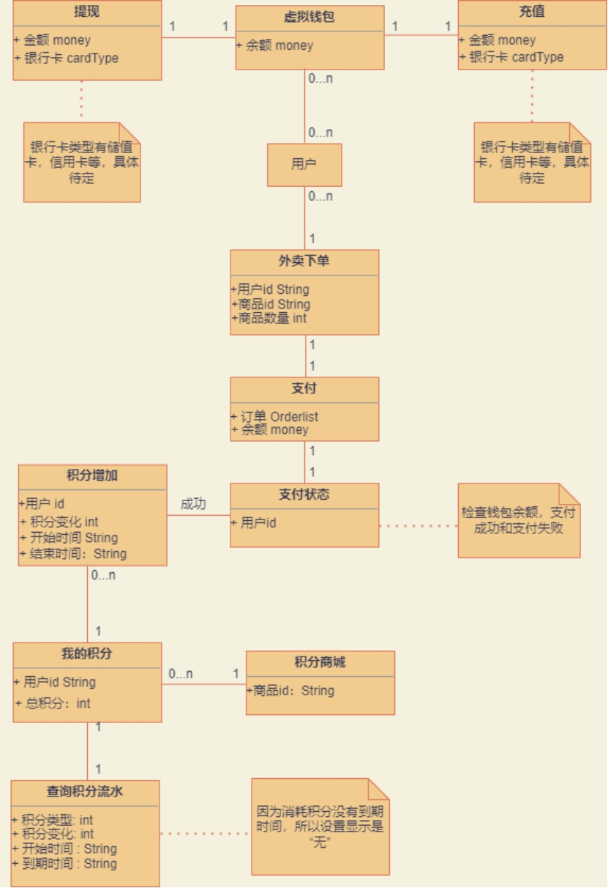 

 

## 4.  业务流程分析

## 4.1概述

整体上展现了购买获取积分的过程。

## 4.2概述

购买获得积分流程

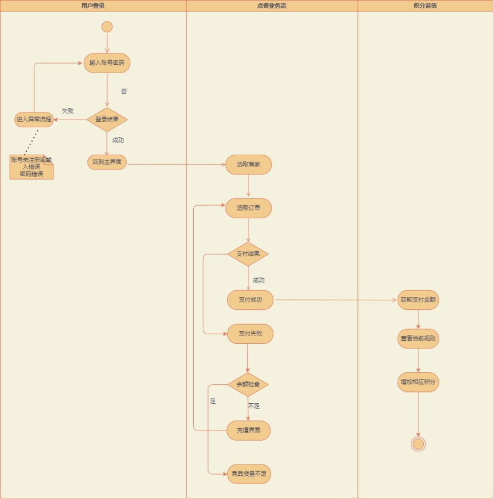 

## 5.  功能性需求

## 5.1  执行者分析

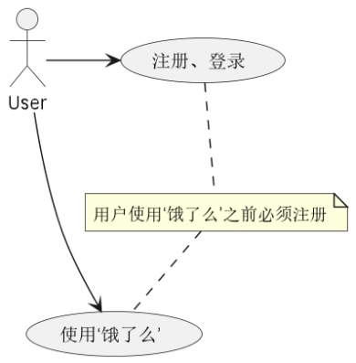 

## 5.2  总用例图

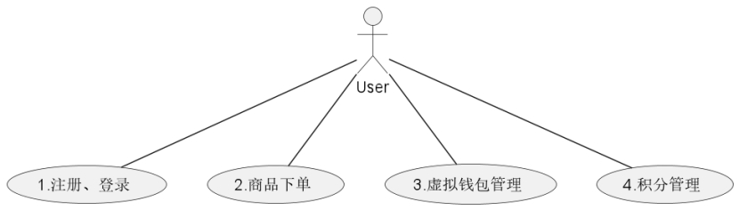 

| ***\*编号\****     | 1                                                            | ***\*名称\****   | ***\*注册用户\**** |
| ------------------ | ------------------------------------------------------------ | ---------------- | ------------------ |
| ***\*执行者\****   | 用户                                                         | ***\*优先级\**** | 高                 |
| ***\*描述\****     | 用户首次进入该系统，注册用户信息                             |                  |                    |
| ***\*前置条件\**** | 无                                                           |                  |                    |
| ***\*基本流程\**** | 1.指示注册系统2.显示开始注册3.提交注册信息4.显示注册结果     |                  |                    |
| ***\*结束状况\**** | 系统提示相关信息，并给出用户最终的注册结果，成功的话保存用户的信息 |                  |                    |
| ***\*说明\****     | 用户提交的信息应该包括：用户名、密码、性别等信息，应注意用户名应因为用户手机号。 |                  |                    |

 

| ***\*编号\****     | 2                                              | ***\*名称\****   | ***\*登入系统\**** |
| ------------------ | ---------------------------------------------- | ---------------- | ------------------ |
| ***\*执行者\****   | 用户                                           | ***\*优先级\**** | 高                 |
| ***\*描述\****     | 用户依靠已有的账户登入本系统                   |                  |                    |
| ***\*前置条件\**** | 用户已有本系统的账户                           |                  |                    |
| ***\*基本流程\**** | 1.用户输入用户名、密码2.系统给予反馈           |                  |                    |
| ***\*结束状况\**** | 1.用户成功登入本系统2.用户的用户名或者密码错误 |                  |                    |
| ***\*说明\****     | 无                                             |                  |                    |

 

| ***\*编号\****     | 3                                                        | ***\*名称\****   | ***\*修改地址\**** |
| ------------------ | -------------------------------------------------------- | ---------------- | ------------------ |
| ***\*执行者\****   | 用户                                                     | ***\*优先级\**** | 低                 |
| ***\*描述\****     | 用户每个人都有一个地址用来接受外卖，可以修改             |                  |                    |
| ***\*前置条件\**** | 用户拥有本系统的账户和密码                               |                  |                    |
| ***\*基本流程\**** | 1.指示修改地址2.提示在修改地址3.提交新地址4.反馈修改结果 |                  |                    |
| ***\*结束状况\**** | 将数据库中的本用户的地址修改成对应结果                   |                  |                    |
| ***\*说明\****     | 无                                                       |                  |                    |

 

 

 

| ***\*编号\****     | 4                                              | ***\*名称\****   | ***\*查看所有卖家商品\**** |
| ------------------ | ---------------------------------------------- | ---------------- | -------------------------- |
| ***\*执行者\****   | 用户                                           | ***\*优先级\**** | 低                         |
| ***\*描述\****     | 用户就能看到所上架的商家以及商家商品           |                  |                            |
| ***\*前置条件\**** | 无                                             |                  |                            |
| ***\*基本流程\**** | 1.指示查看所有商品2.显示所有商品或者提示无商品 |                  |                            |
| ***\*结束状况\**** | 系统的数据不会发生任何变化                     |                  |                            |
| ***\*说明\****     | 无                                             |                  |                            |

 

| ***\*编号\****     | 5                                                | ***\*名称\****   | ***\*查询虚拟钱包余额\**** |
| ------------------ | ------------------------------------------------ | ---------------- | -------------------------- |
| ***\*执行者\****   | 用户                                             | ***\*优先级\**** | 低                         |
| ***\*描述\****     | 每个买家拥有一个应用内的虚拟钱包，可以查看其余额 |                  |                            |
| ***\*前置条件\**** | 无                                               |                  |                            |
| ***\*基本流程\**** | 1.指示查询钱包余额2.提示在查询余额并返回余额数目 |                  |                            |
| ***\*结束状况\**** | 对系统内数据无任何影响                           |                  |                            |
| ***\*说明\****     | 无                                               |                  |                            |

 

| ***\*编号\****     | 6                                                            | ***\*名称\****   | ***\*使用虚拟钱包支付\**** |
| ------------------ | ------------------------------------------------------------ | ---------------- | -------------------------- |
| ***\*执行者\****   | 用户                                                         | ***\*优先级\**** | 高                         |
| ***\*描述\****     | 买家进入支付页面，可以选择钱包支付                           |                  |                            |
| ***\*前置条件\**** | 买家已经选好了商品，进入支付页面                             |                  |                            |
| ***\*基本流程\**** | 1.提示钱包支付2.用户选择钱包支付3.输入金额4.系统反馈支付状态5.若支付成功，生成相应的交易流水 |                  |                            |
| ***\*结束状况\**** | 数据库中用户的虚拟钱包余额减少，对应商家的钱包余额增加，交易流水表增加一条新记录。 |                  |                            |
| ***\*说明\****     | 无                                                           |                  |                            |

 

 

| ***\*编号\****     | 7                                                    | ***\*名称\****   | ***\*查看订单信息\**** |
| ------------------ | ---------------------------------------------------- | ---------------- | ---------------------- |
| ***\*执行者\****   | 用户                                                 | ***\*优先级\**** | 低                     |
| ***\*描述\****     | 买家可以查看已经购买的订单信息                       |                  |                        |
| ***\*前置条件\**** | 买家已经购买了某商品                                 |                  |                        |
| ***\*基本流程\**** | 1.指示查看订单信息2.提示在查看订单信息3.返回查询结果 |                  |                        |
| ***\*结束状况\**** | 不会对本系统的数据有任何影响                         |                  |                        |
| ***\*说明\****     | 无                                                   |                  |                        |

 

| ***\*编号\****     | 8                                                | ***\*名称\****   | ***\*查询积分\**** |
| ------------------ | ------------------------------------------------ | ---------------- | ------------------ |
| ***\*执行者\****   | 用户                                             | ***\*优先级\**** | 高                 |
| ***\*描述\****     | 买家购买了商品后，会按照一定的兑换比例来兑换积分 |                  |                    |
| ***\*前置条件\**** | 无                                               |                  |                    |
| ***\*基本流程\**** | 1.指示查询积分2.提示在查询积分并且返回积分数量   |                  |                    |
| ***\*结束状况\**** | 对系统内数据无任何影响                           |                  |                    |
| ***\*说明\****     | 无                                               |                  |                    |

 

***\*
\****

## 6.  非功能性需求

## 6.1  系统架构要求

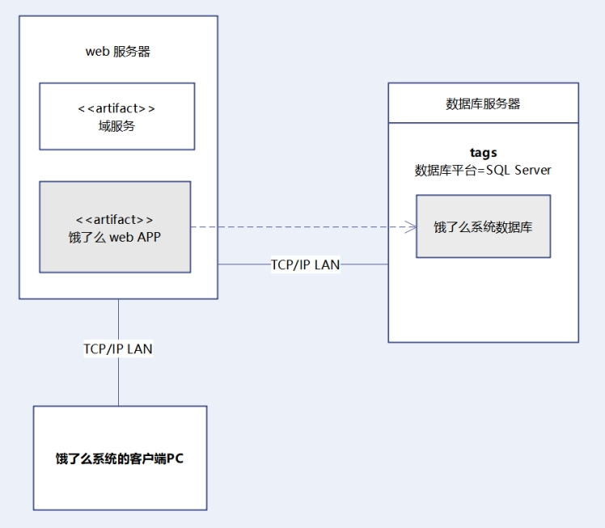 

说明：图中非深色部分是原来的IT架构，深色部分是新增加的情况。

## 6.2  接口

本项目没有非功能性需求接口。

## 6.3  安全性

### 6.3.1 程序安全

l 设置用户访问权限。

l 提供运行日志管理及安全审计功能，可追踪程序的历史使用情况。

l 防止应用信息泄露（目录遍历、版本信息）。

l 文件分离存储，增加访问权限控制，防止泄露。

l 限定用户、IP等访问，进行高频访问、登录限制防攻击。

### 6.3.2 数据安全

l 数据加密保护，保证数据在采集、传输、处理过程中不被偷窥、窃取、篡改。

l 数据根据密级分不同网络环境存储。

l 加强隐私数据保护。

### 6.3.3 系统安全

l 进行容灾处理。

## 6.4  性能

### 6.4.1 响应时间

l 页面间跳转时间<=3s,精确搜索反馈结果<=1s。

l 对于大数据量加载，分页展示，提供进度条及预计时间，减少用户焦虑。

 

### 6.4.2 吞吐量

l 与系统并发相关，根据业务量估算系统需要支持多少并发。

### 6.4.3 资源利用率

l 投入资源的使用率需要达到一定的水平，避免资源浪费。

## 6.5  界面

l 统一风格，同一项目或范围内系统风格、布局保持一致。

l 使用户易操作。

l 符合基本的软件设计规范。

l 充分考虑视觉因素，界面美观，用户使用具有舒适性，避免使用刺激性的配色。

## 7.  附录

| 资料名称                           | 提供者     | 获取日期   | 说明 |
| ---------------------------------- | ---------- | ---------- | ---- |
| UML大战需求分析                    | 智慧树资料 | 2022/10/1  |      |
| 阿里巴巴-Java开发手册-1.7.0-嵩山版 | 智慧树资料 | 2022/10/1  |      |
| 深入理解计算机系统                 | 团队拥有   | 2022/10/1  |      |
| HTML5 权威指南                     | 团队拥有   | 2022/9/10  |      |
| CSS权威指南 第4版上下册            | 团队拥有   | 2022/9/12  |      |
| 深入解析CSS                        | 团队拥有   | 2022/9/15  |      |
| JavaScript高级程序设计 第4版       | 团队拥有   | 2022/10/16 |      |
| JavaScript 指南 原书第7版          | 团队拥有   | 2022/9/18  |      |
| HTTP权威指南                       | 团队拥有   | 2022/10/29 |      |
| 计算机网络：自顶向下方法           | 团队拥有   | 2022/9/10  |      |
| 深入理解Spring Cloud与微服务构建   | 团队拥有   | 2023/2/15  |      |

##  

## 8.  版本修订记录

| 日期       | 作者                   | 内容提要                           | 版本 |
| ---------- | ---------------------- | ---------------------------------- | ---- |
| 2022/9/30  | 刘京宗田欣悦缪妍王明源 | 完成“饿了么”点餐业务               | 0.1  |
| 2022/11/30 | 刘京宗田欣悦缪妍王明源 | 向“饿了么”添加虚拟钱包和积分系统   | 0.2  |
| 2023/4/3   | 刘京宗田欣悦缪妍王明源 | 完成“饿了么”Spring Cloud项目的实现 | 0.3  |

 

# 第2章 项目设计

## 1. 数据库设计

## 1.1 点餐业务流

business（商家表）：

| No   | 字段名          | 数据类型    | size   | 默认 值 | 约束         | 说明                                                         |
| ---- | --------------- | ----------- | ------ | ------- | ------------ | ------------------------------------------------------------ |
| 1    | businessld      | int         |        |         | PK、 Al、 NN | 商家编号                                                     |
| 2    | businessName    | varchar     | 40     |         | NN           | 商家名称                                                     |
| 3    | businessAddress | varchar     | 50     |         |              | 商家地址                                                     |
| 4    | businessExplain | varchar     | 40     |         |              | 商家介绍                                                     |
| 5    | business lmg    | medium text |        |         | NN           | 商家图片                                                     |
| 6    | orderTypeld     | int         |        |         | NN           | 点餐分类： 1：美食、2： 早餐、3：跑腿代购、4：汉堡 披萨、5：甜品饮品、6：速食 简餐、7：地方小吃、8：米粉 面馆、9：包子粥铺、10：炸 鸡炸串 |
| 7    | starPrice       | decimal     | (5，2) | 0.00    |              | 起送费                                                       |
| 8    | deliveryPrice   | decimal     | (5，2) | 0.00    |              | 配送费                                                       |
| 9    | remarks         | varchar     | 40     |         |              | 备注                                                         |
| 10   | userId          | varchar     | 20     |         | NN、FK       | 商家的用户Id                                                 |

 

food（食品表）：

| No   | 字段名      | 数据类型    | size   | 默认值 | 约束       | 说明         |
| ---- | ----------- | ----------- | ------ | ------ | ---------- | ------------ |
| 1    | foodld      | int         |        |        | PK、AI、NN | 食品编号     |
| 2    | foodName    | varchar     | 30     |        | NN         | 食品名称     |
| 3    | foodExplain | varchar     | 30     |        | NN         | 食品介绍     |
| 4    | foodlmg     | medium text |        |        | NN         | 食品图片     |
| 5    | foodPrice   | decimal     | (5，2) |        | NN         | 食品价格     |
| 6    | businessld  | int         |        |        | FK、NN     | 所属商家编号 |
| 7    | remarks     | varchar     | 40     |        |            | 备注         |

 

cart（购物车表）：

| No   | 字段名     | 数据类型 | size | 默认值 | 约束       | 说明                   |
| ---- | ---------- | -------- | ---- | ------ | ---------- | ---------------------- |
| 1    | cartld     | int      |      |        | PK、Al、NN | 无意义编号             |
| 2    | foodld     | int      |      |        | FK、 NN    | 食品编号               |
| 3    | businessld | int      |      |        | FK、 NN    | 所属商家编号           |
| 4    | userld     | varchar  | 20   |        | FK、 NN    | 所属用户编号           |
| 5    | quantity   | int      |      |        | NN         | 同一类型食品的购买数量 |

 

deliveryaddress（送货地址表） ：

| No   | 字段名      | 数据类型 | size | 默认值 | 约束       | 说明         |
| ---- | ----------- | -------- | ---- | ------ | ---------- | ------------ |
| 1    | dald        | int      |      |        | PK、AI、NN | 送货地址编号 |
| 2    | contactName | varchar  | 20   |        | NN         | 联系人姓名   |
| 3    | contactSex  | int      |      |        | NN         | 联系人性别   |
| 4    | contactTel  | varchar  | 20   |        | NN         | 联系人电话   |
| 5    | address     | varchar  | 100  |        | NN         | 送货地址     |
| 6    | userld      | varchar  | 20   |        | FK、NN     | 所属用户编号 |

 

orders（订单表）：

| No   | 字段名     | 数据类 型 | size   | 默认 值 | 约束        | 说明                            |
| ---- | ---------- | --------- | ------ | ------- | ----------- | ------------------------------- |
| 1    | orderld    | int       |        |         | PK、AI、 NN | 订单编号                        |
| 2    | userld     | varchar   | 20     |         | FK、 NN     | 所属用户编号                    |
| 3    | businessld | int       |        |         | FK、NN      | 所属商家编号                    |
| 4    | orderDate  | varchar   | 20     |         | NN          | 订购日期                        |
| 5    | orderTotal | decimal   | (7，2) | 0.00    | NN          | 订单总价                        |
| 6    | dald       | int       |        |         | FK、 NN     | 所属送货地址编号                |
| 7    | orderState | int       |        | 0       | NN          | 订单状态(0：未支付； 1：已支付) |
| 8    | riderId    | varchar   | 20     |         | FK、 NN     | 接单骑手的用户编号              |

 

orderdetailet（订单明细表）

| No   | 字段名   | 数据类型 | size | 默认值 | 约束       | 说明         |
| ---- | -------- | -------- | ---- | ------ | ---------- | ------------ |
| 1    | odld     | int      |      |        | PK、AI、NN | 订单明细编号 |
| 2    | orderld  | int      |      |        | FK、 NN    | 所属订单编号 |
| 3    | foodld   | int      |      |        | FK、NN     | 所属食品编号 |
| 4    | quantity | int      |      |        | NN         | 数量         |

 

 

 

user（用户表）：

| No   | 字段名   | 数据类型    | size | 默认 值 | 约束    | 说明                                  |
| ---- | -------- | ----------- | ---- | ------- | ------- | ------------------------------------- |
| 1    | userld   | varchar     | 20   |         | PK、 NN | 用户编号                              |
| 2    | password | varchar     | 20   |         | NN      | 密码                                  |
| 3    | userName | varchar     | 20   |         | NN      | 用户名称                              |
| 4    | userSex  | int         |      |         | NN      | 用户性别(1：男；0：女)                |
| 5    | userlmg  | medium text |      |         |         | 用户头像                              |
| 6    | delTag   | int         |      | 1       | NN      | 删除标记(1：正常；0：删 除)           |
| 7    | type     | int         |      | 1       |         | 用户类型（1：顾客，2：商家，3：骑手） |

 

## 1.2 积分模块

积分流水表（记录所有的积分流水）：

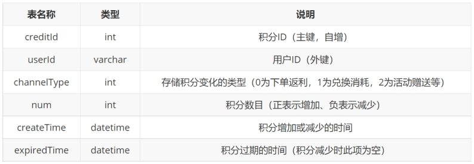 

 

可用积分表（记录当前还未过期的积分）：

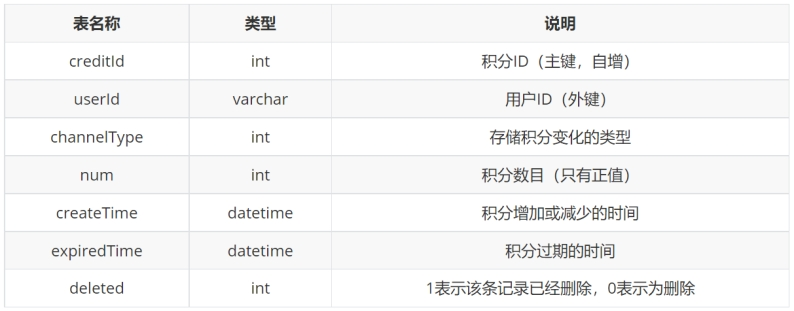 

 

## 1.3 虚拟钱包模块

virtualwallet表：存储用户虚拟钱包信息

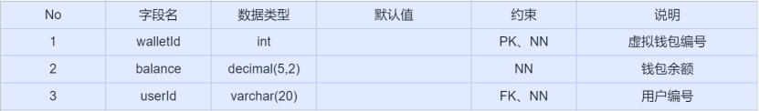 

 

bvirtualwallet表：存储商家虚拟钱包信息

 

 

virtualwallettransaction表：存储交易流水信息

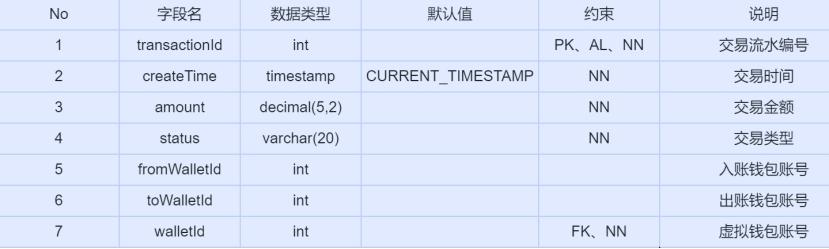 

 

bankcard表：存储银行卡信息

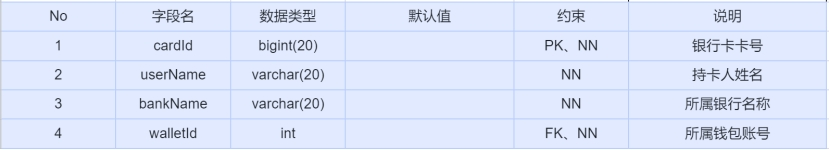 

 

## 3. 接口设计

点餐业务流：

1.business

(1)get+Business/OrderTypeId

参数：orderTypeId

返回值：business数组

功能：根据点餐分类编号查询所属商家信息

(2)get+Business/BusinessId

参数：businessId

返回值：business对象

功能：根据商家编号查询商家信息

 

2.food

(1)get方法+Food/BusinessId

参数：businessId

返回值：food数组

功能：根据商家编号查询所属食品信息

3. cart

(1)get+Cart/CartList

参数：userId、businessId（可选）

返回值：cart数组（多对一：所属商家信息、所属食品信息）

功能：根据用户编号查询此用户所有购物车信息;根据用户编号和商家编号，

查询此用户购物车中某个商家的所有购物车信息

(2)post+Cart/Order

参数：userId、businessId、foodId

返回值：int（影响的行数）

功能：向购物车表中添加一条记录

参数：userId、businessId、foodId、quantity

返回值：int（影响的行数）

功能：根据用户编号、商家编号、食品编号更新数

(3)put+Cart/Order

参数：userId、businessId、foodId、quantity

返回值：int（影响的行数）

功能：根据用户编号、商家编号、食品编号更新数量

(4)delete+Cart/Order

参数：userId、businessId、foodId（可选）

返回值：int（影响的行数）

功能：根据用户编号、商家编号、食品编号删除购物车表中的一条食品记

录;根据用户编号、商家编号删除购物车表中的多条条记录

 

4.deliveryAddress

(1)get+DeliveryAddress/UserId

参数：userId

返回值：deliveryAddress数组

功能：根据用户编号查询所属送货地址

 

 

(2)get+DeliveryAddress/DaId

参数：daId

返回值：deliveryAddress对象

功能：根据送货地址编号查询送货地址

(3)post+DeliveryAddress/DaId

参数：contactName、contactSex、contactTel、address、userId

返回值：int（影响的行数）

功能：向送货地址表中添加一条记录

(4)put+DeliveryAddress/DaId

参数：daId、contactName、contactSex、contactTel、address、userId

返回值：int（影响的行数）

功能：根据送货地址编号更新送货地址信息

(5)delete+DeliveryAddress/DaId

参数：daId

返回值：int（影响的行数）

功能：根据送货地址编号删除一条记录

 

5.orders

(1)post+Orders/OrdersId

参数：userId、businessId、daId、orderTotal

返回值：int（订单编号）

功能：根据用户编号、商家编号、订单总金额、送货地址编号向订单表中

添加一条记录，并获取自动生成的订单编号，然后根据用户编号、商家编号	从购物车表中查询所有数据，批量添加到订单明细表中，然后根据用户编号、	商家编号删除购物车表中的数据。

 

(2)get+Orders/OrdersId

参数：orderId

返回值：orders对象（包括多对一：商家信息；一对多：订单明细信息）

功能：根据订单编号查询订单信息，包括所属商家信息，和此订单的所有

订单明细信息

(3)get+Orders/userId

参数：userId

返回值：orders数组（包括多对一：商家信息；一对多：订单明细信息）

功能：根据用户编号查询此用户的所有订单信息

6.user

(1)get+User/Login

参数：userId、password

返回值：user对象

功能：根据用户编号与密码查询用户信息

(2)get+User/UserId

参数：userId

返回值：int（返回行数）

功能：根据用户编号查询用户表返回的行数

(3)post+User/UserId

参数：userId、password、userName、userSex

返回值：int（影响的行数）

功能：向用户表中添加一条记录

 

***\*积分模块：\****

(1) get方法+Credit/totalNum

  参数：userId

  返回值：int

  功能：获得当前用户的全部可用积分数目

(2) get方法+Credit/availableCredit

  参数：userId

  返回值：credit 数组

  功能：获得当前用户的全部可用积分明细

  

(3) get方法+Credit/userId

  参数：userId

  返回值：credit 数组

  功能：获得当前用户的全部积分流水明细

(4) get方法+Credit/channelType

  参数：userId、channelType

  返回值：credit 数组

  功能：获得当前用户指定类型的全部积分流水明细

(5) post方法+Credit/userId

  参数：userId、channelType、num

  返回值：int

  功能：向积分流水表中添加一条记录（注意要判断，不能使消费积分大于当前积分）

 

***\*虚拟钱包模块：\****

 

(1) get方法 + VirtualWallet/UserId

  参数：userId

  返回值：VirtualWallet对象

  功能：根据用户Id查询虚拟钱包

(2) get方法 + VirtualWallet/WalletId

  参数：walletId

  返回值：balance（账户余额）

  功能：根据虚拟钱包Id查询余额

(3) post方法 + VirtualWallet/FromWalletId

参数：walletId，amount

  返回值：int（0代表失败，1代表成功）

  功能：虚拟钱包提现

(4) post方法 + VirtualWallet/ToWalletId

参数：walletId，amount

  返回值：int（0代表失败，1代表成功） 

功能：虚拟钱包充值  

 

(5) post + VirtualWallet/WalletId 

  参数：fromWalletId，toWalletId，amount，orderId

  返回值：int（0代表失败，1代表成功）

  功能：虚拟钱包支付

(6) get+ VirtualWalletTransaction/WalletId

参数：walletId

  返回值：VirtualWalletTransaction数组

功能：根据虚拟钱包编号查询相应的交易记录

(7) post+BankCard/CardId

参数：cardId, userName, bankName, walletId

  返回值：int（影响的行数）

功能：添加银行卡

(8) get+BankCard/WalletId

参数：walletId

  返回值：BankCard数组

功能：根据虚拟钱包Id查询银行卡

(9) get + BVirtualWallet/BusinessId

  参数：businessId

  返回值：BVirtualWallet对象

功能：根据商家Id查询商家虚拟钱包

## 4. 软件架构

1. Spring cloud微服务集群整体架构

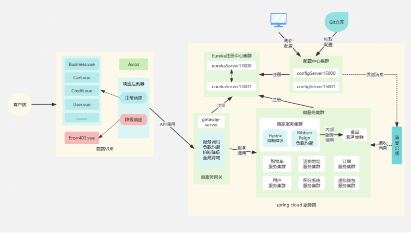 

 

2. 创建每个微服务时，项目采用基于Servlet的简易MVC架构，采用约定优于配置的原则来搭建简易MVC框架，如下图所示：

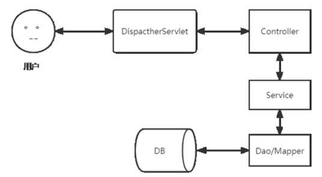 

3. 分层设计（以积分系统模块和钱包系统模块为例）

积分系统模块：

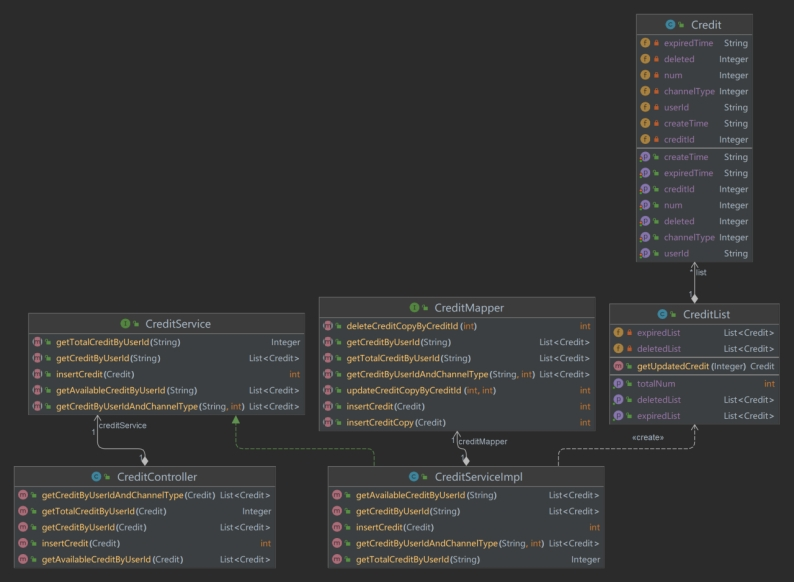 

 

虚拟钱包模块：

Mapper层

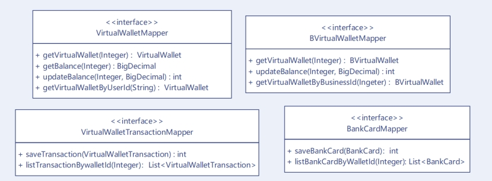 

Service层

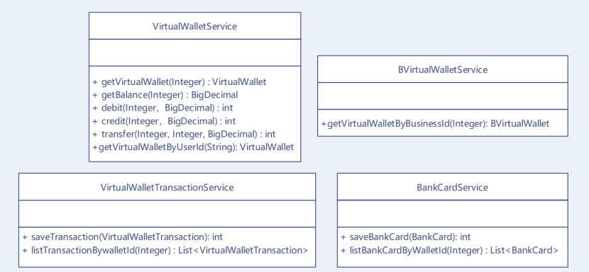 

Controller层:

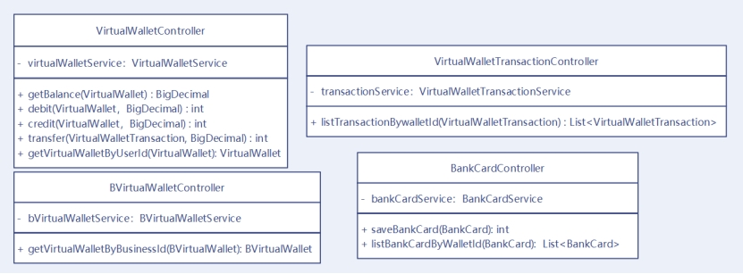 

 

 

 

 

 

# 第3章 项目测试

## 1. 前端页面

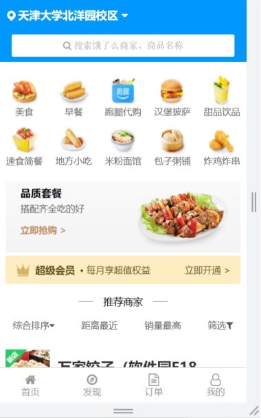   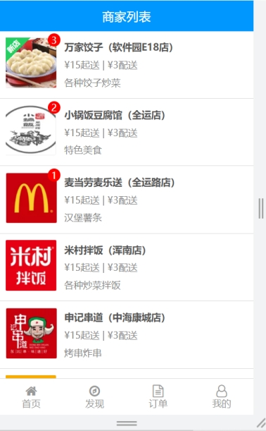

​	首页                商家列表

 

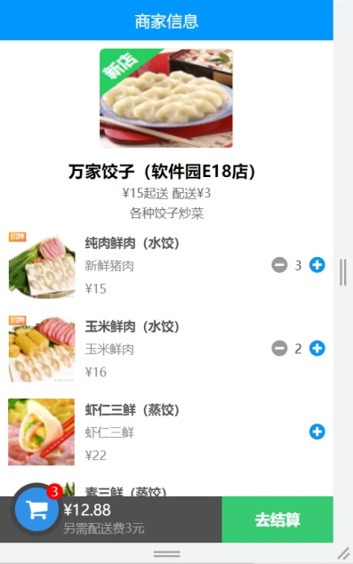  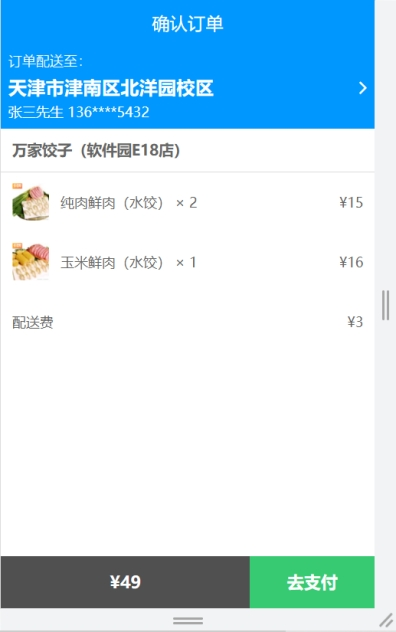

商家信息              确认订单

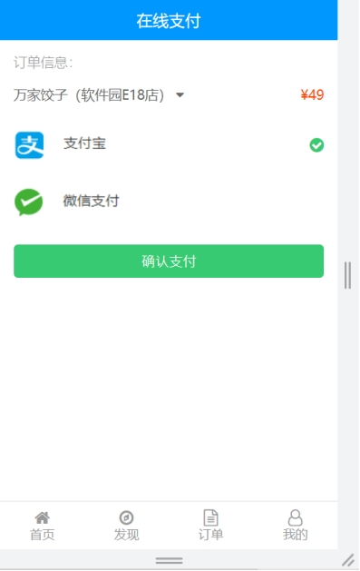  

在线支付	登录

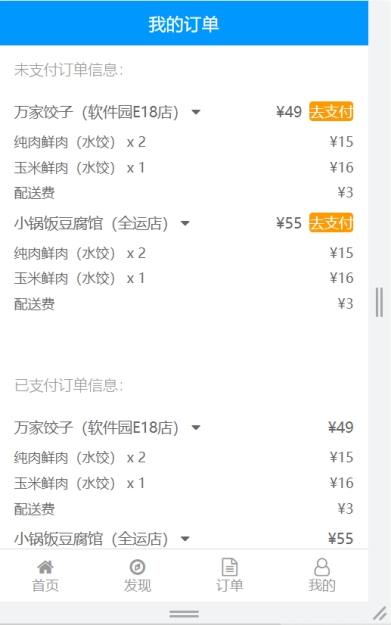  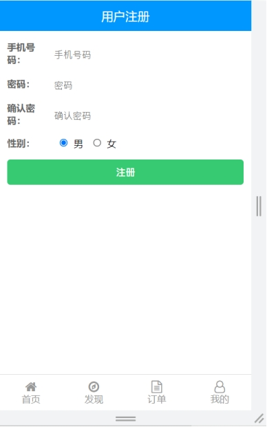

历史订单	注册

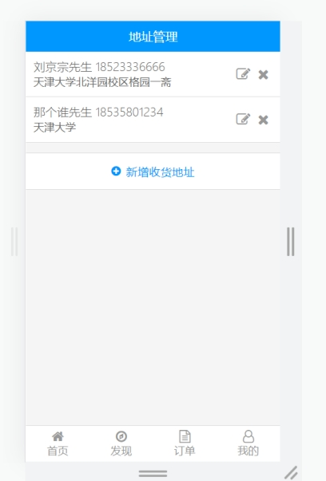   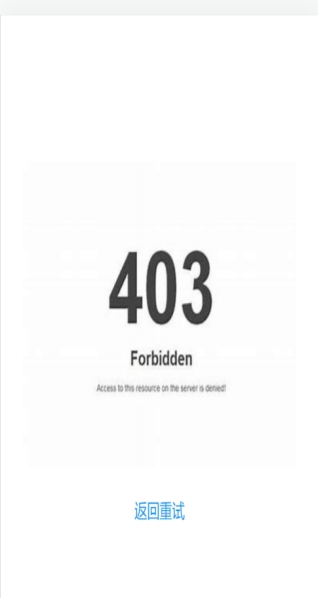

 

地址管理	降级响应

 

     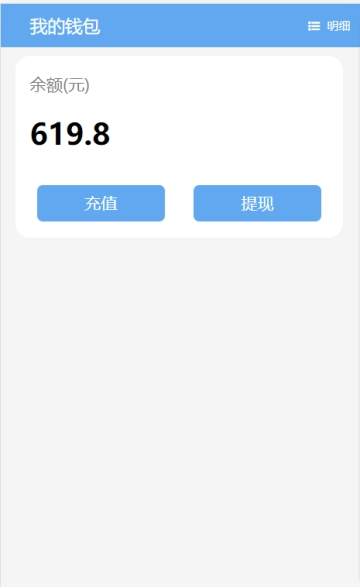

我的信息                     我的钱包

​               

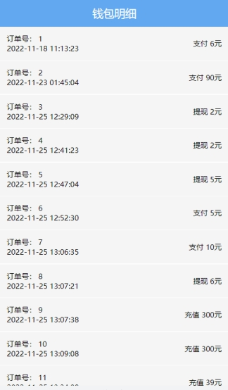      

钱包明细                 充值界面

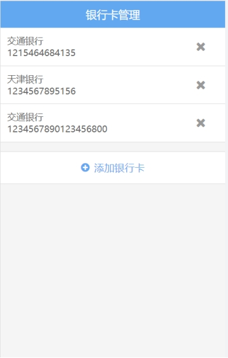   

银行卡管理               添加银行卡

 

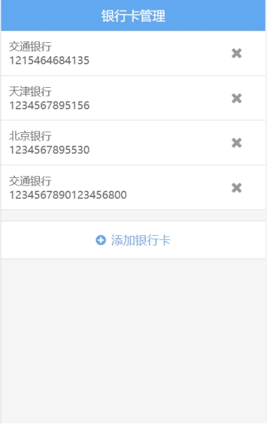  

添加银行卡成功            选择银行卡成功

   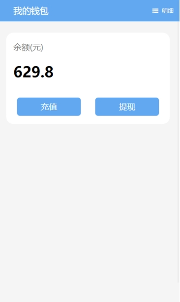

钱包充值               充值成功

  

钱包提现              提现成功

  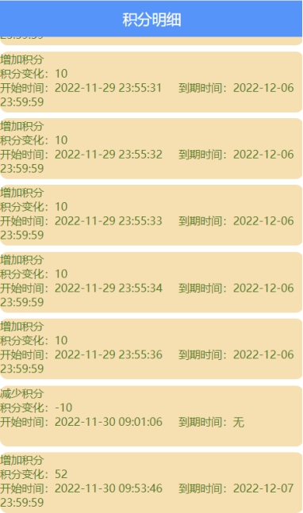

我的积分                积分流水

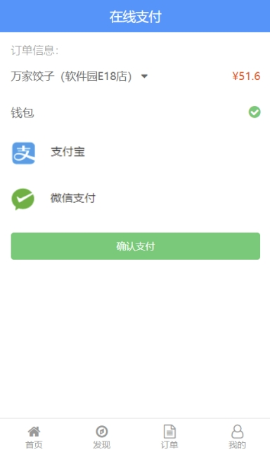  

支付订单              积分增加

 

积分商城						兑换成功（if积分足够）

    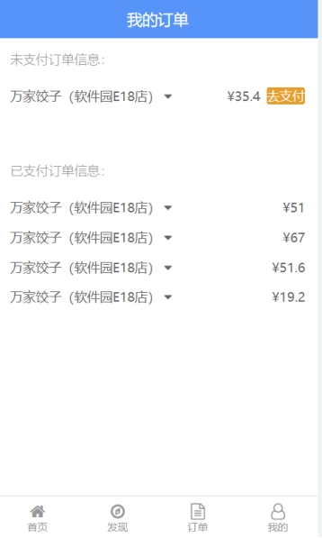

兑换后积分							 历史订单增加显示

 

***\*2.\**** ***\*后端\*******\*测试\****

使用postman对项目接口进行测试。

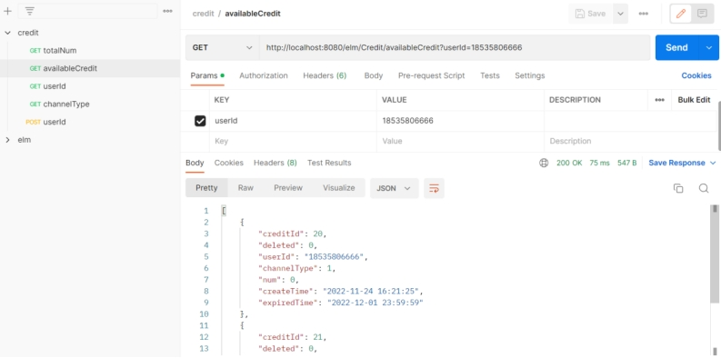 

 

 

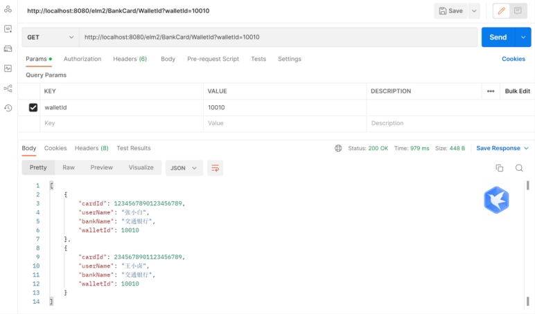 

# 第4章 项目特色

## 1. 面向对象设计原则的体现

（1）面向接口而非实现编程

上游系统面向接口而非实现编程,不依赖不稳定的实现细节,这样当实现发生变化的时候,上游系统的代码基本上不需要做改动,以此来降低耦合性,提高扩展性。 例如CreditController在调用Service层时，调用的是CreditService这个实现类，而非具体的实现类。

（2）高内聚、松耦合

例如在CreditImpl类中，要实现优先消费临近过期的积分这一功能。我们选择将这一功能的实现委托给CreditList来实现，CreditImpl只需调用CreditList的方法即可。

（3）LoD 迪米特法则，又称 LKP 最少知识原则

迪米特法则(Law of Demeter,LoD)也称为最少知识原则(Least Knowledge Principle,LKP),虽然名字不同,但描述的是同一个规则:一个对象应该对其他对象有最少的了解。项目中代码分层实现、Service层委托实体类来实现、使用充血模型而非贫血模型，这些都体现了这一原则。

（4）DRY 原则

DRY原则:Don’t Repeat Yourselt, 简称DRY。例如在实现过程中需要多次对解析表示时间的String，并且对时间进行比较等操作，我们将这些重复的代码写到了util.CommonUtil中，提高代码的可复用性。

（5）封装特性

在项目设计中采用充血模型，实体对象层po层中的virtualwallet类和bvirtualwallet类中既有数据又有逻辑操作函数，使数据和对应的业务逻辑被封装到同一个类中，是典型的面向对象编程风格，充分体现了面向对象的封装特性。

（6）依赖倒置原则

在项目设计中程序依赖于抽象接口，不要依赖于具体实现。Service层中有接口和实现类，Controller层调用service层的接口，对抽象进行编程。让用户程序依赖于抽象，实现的细节也依赖于抽象，这样就降低了客户与实现模块间的耦合性。

（7）单一职责原则

就一个类而言，应该仅有一个引起它变化的原因。一个对象应该只包含单一的职责，并且该职责被完整地封装在一个类中。例如：实现了逻辑和界面的分离。Mapper层负责与数据库交互，在Mapper层中的每一个类中只涉及到对一个数据库表的增删改查。

## 2.  其他项目特色

## 2.1代码分层（横向切分） 

大部分业务系统的开发都可以分为三层：Contoller 层、Service 层、Mapper层。其中 Controller 用来与前端用户界面交互，Service 层用来处理业务逻辑，Mapper层用来与数据库交互。这样做的好处是： 

n 分层能起到代码复用的作用 

n 分层能起到隔离变化的作用 

n 分层能起到隔离关注点的作用 

n 分层能提高代码的可测试性 

n 分层能应对系统的复杂性

## 2.2	RESTful风格的接口设计

设计了RESTful风格的接口。 RESTfulAPI中，URL中只使用名词来指定资源，原则上不使用动词。多人协作时，统一风格，可提高沟通效率。

## 2.3	使用充血模型

项目设计使用充血模型，在 po 层的实体对象类中加入特定的业务逻辑函数，使数据和对应的业务逻辑被封装到同一个类中，这种充血模型满足面向对象的封装特性，是典型的面向对象编程风格。

## 3. Spring Could架构特色

(1) 服务注册与发现：本项目使用 Eureka 作为服务注册中心，使用 Spring Cloud Netflix Eureka Client 进行服务的注册和发现。通过这种方式，各个微服务之间可以相互发现和调用，从而实现了分布式系统中服务的动态发现和管理。

 

(2) 负载均衡和容错处理：本项目使用 Ribbon 和 Feign 进行负载均衡和容错处理。通过使用这些组件，可以实现请求的负载均衡和容错处理，从而提高了系统的可用性和可靠性。

 

(3) 配置管理：本项目使用 Spring Cloud Config 组件集中管理分布式系统的配置文件，将配置文件存储在配置中心，然后在应用程序启动时从配置中心读取配置。这样可以方便地管理应用程序的配置，并且可以在配置变更时自动刷新应用程序的配置，从而提高系统的可维护性。

 

(4) API 网关：本项目使用 Spring Cloud Gateway 构建了一个 API 网关，将多个微服务的 API 统一管理和暴露，从而简化客户端的调用。同时，API 网关还实现了统一的认证和安全控制，提高了系统的安全性。

 

(5) 分布式事务：本项目使用 Spring Cloud Bus 和 Spring Cloud Sleuth 实现了分布式事务的处理和跟踪。通过使用这些组件，可以实现分布式事务的一致性和可靠性，同时也可以实现更高效的跟踪和日志管理。

 

这些特色使得本项目具有良好的可用性、可维护性和可扩展性，能够满足复杂分布式系统的需求。同时，这些特色也能够帮助我们更高效地构建和管理分布式系统。

# 第5章 感悟与收获

我们团队在完成本次项目时，主要有以下几点感悟和收获：

 

1．分布式系统的设计和实现需要充分考虑系统的可用性和可扩展性。通过使用 Spring Cloud 的组件，我们可以快速构建一个具有高可用性和可扩展性的分布式系统。

 

2．分布式系统中服务之间的通信和数据交互是一个重要的问题。通过使用 Spring Cloud 的服务注册与发现、负载均衡和容错处理等组件，可以方便地实现服务之间的通信和数据交互，从而构建一个高效可靠的分布式系统。

 

3．前后端分离的架构能够提高系统的可维护性和扩展性。通过使用 Vue 构建前端应用程序，我们可以将前端和后端进行分离，使得前端和后端的开发工作可以独立进行，并且可以更方便地进行集成和部署。

 

4．通过使用开源框架和组件，我们可以节省大量的开发时间和成本，并且可以提高开发的效率和质量。Spring Cloud 和 Vue 都是优秀的开源框架和组件，通过使用它们，我们可以快速构建一个高效、稳定和可靠的分布式系统。

 

5．在开发过程中，良好的团队协作和沟通是非常重要的。通过团队成员之间的协作和沟通，可以更好地理解需求和业务逻辑，从而更好地完成项目开发。同时，也可以更好地进行项目管理和控制，确保项目的顺利完成。

 

通过本次项目的开发，我们学习到了很多有关分布式系统架构和前端开发的知识，并且也掌握了一些优秀的开源框架和组件的使用。同时，也感受到了团队协作和沟通的重要性，这些知识和经验对我们的未来发展会有很大的帮助。

 

 

 

 

# 第6章 课程评价及建议

## 6.1 课程评价

本课程总体来说难度适中，涵盖了Spring Cloud微服务框架的基础和核心组件，对于初学者来说非常实用和有价值。尤其是通过实践开发项目，让我们更加深入理解和掌握了Spring Cloud的知识。

但是，本课程在实践中存在一些重复性操作，这会给学习带来一些困扰。同时，在讲解过程中，对于一些原理性的知识点的解释比较少，很多的操作都是教我们怎么复制和粘贴，缺乏更深层次的理解和思考。

此外，由于我们的项目本就要求使用RESTful接口格式进行书写，所以我们没有按照课程中展示的方式修改接口，而是采用了原本就能使用的接口。这也体现在了后端代码上，使得我们的代码实际上和视频里的不一样。另外，我们发现视频中的接口写法显得繁复冗长，而我们采用的接口则更加简洁明了。

最后，在降级响应方面，视频中提到的403错误应该是一个错误，正确的应该是503错误。此外，视频中使用的开发工具STS已经比较落后，而现在更多的人使用的是IDEA，所以视频里的操作和我们使用的工具有所不同，这也导致了一些时间和精力上的浪费和困扰。

综上所述，本课程内容丰富，实践性强，但在实践中存在一些重复性操作，同时需要更多的原理性解释和思考。此外，视频中的一些细节问题也需要及时修正和更新，以保证教学效果的最大化。

## 6.2 课程建议

1．希望能增加更多的实战案例和项目实践，帮助学生更好地应用Spring Cloud微服务框架开发实际项目。我们现在，包括之前的中级实践就是一个很好的扩展，但是只是扩展组件，这种方式其实很多组在综合实践部分已经做过了，所以我们觉得可以尝试新的方向，比如独立做一个小的项目。

2．希望能够加强对Docker等容器化技术的介绍和应用，这将有助于更好地管理和部署Spring Cloud应用程序。

3．希望加强对实践的指导。虽然本课程的项目实践很好，但是在实践过程中，我们仍然可能会遇到各种各样的问题，需要一些指导和建议来帮助我们解决问题。因此，希望老师能够在项目实践中加强对实践的指导，解决我们在实践过程中遇到的问题，提高我们的学习效果。

4．希望提供更多的参考资料。Spring Cloud是一个非常庞大的框架，其中包含了很多的组件和功能，对于初学者来说有时候可能会感到有些难以理解。因此，希望老师能够提供更多的参考资料，包括文档、教程、视频等，帮助我们更好地了解Spring Cloud的各个组件和功能，提高我们的学习效果。

5．最后就是能添加一些审查机制，我们中期审查一次，期末审查一次，至少从我的视角很多人都是赶的作业，加上代码好多都给了，这样可能对于部分同学来说达不到学习效果，像我们组这种每1-2周开会的基本没有，所以我们觉得可以增加审查机制，督促同学们学习。

 